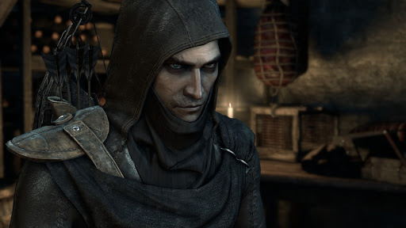

# Портрет

# История персонажа

Лазарь. Он не знает своих родителей, его нашли возле порога одного здания которое оказалось храмом ордена "Драконы Теней". Их главный увидел в Лазаре сильное сердце! Он сказал что Лазарь будет великим вором. Его приняли в гильдию, вырастили и воспитали там.

Начали растить и обучать, как воровать, как взламывать замки, стрелять с лука, научили акробатике и скрытности.

Суть ордена: братство ордена верит в то что до Островного Катаклизма существовал Дракон Теней. Основатель этого ордена жил еще 2000 лет назад незадолго после катаклизма, он был обычным бедняком, но потом, по легенде нашел кольцо с изображением дракона (копию кольца носят все члены братства). Когда он нашел кольцо, то он увидел тень дракона, этот дракон представился как Анасафонус. Он в миг обучил Предводителя всем навыкам скрытности и боевым искуствам, рассказал ему про суть мироздания и приказал построить свой алтарь и делать подношения, иначе он разрушит весь мир. После этого видения предводитель и основал орден Дракона Теней, начал ему поклоняться и построиль храм и алтарь, начал делать подношения, набирать и обучать последователей и тоже заставлять их делать подношения. Братья ордена были действительно профессионалами, а их вера и верность текущему Предводителю всегда непоколебима. Это позволило им не только просуществовать 2 тысячи лет, но и сильно влиять на историю мира. Чтоб проверить свою веру - любой новичек в ордене должен отдать литр своей крови на алтарь дракона. Это доказывает их силу и мужественность.
Орден готов работать с любым государством, которое хорошо заплатит. 

Однажды он был на задании ордена с напарницей Деей, они лезли на ратушу, но под ней сломался стекляный потолок, она упала и умерла. Это была любовь Лазаря. До этого проишествия она подарила ему медальен. После ее смерти Лазарь может с ней общаться через этот медальен, изредка она ему отвечает. Кроме него никто не слышыт голос из медальена. Задание они провалили, потому все хорошое отношение ордена к Лазарю испарилось, сейчас он на дне рейтинга и на грани изгнания. К тому же он разбит смертью любимой.

Как и все члены братства, Лазарь коротко обстрижен. На данный момент ему 23, в 18 он прошел инициацию. У ордена есть своя униформа: черный капюшон, маска, кожанная легкая броня, выкрашенная в черный. Знак отличия - кольцо с символом звезды. Образованный, с хорошей дикцией, как и все в братстве. Очень скрытный, умеет слиться с толпой. До провала был одним из лучших в братстве. Внимательный. Свято верит в учение ордена. Он разочарован в жизни из-за своей потери, но у него есть надежда что его возлюбленная счастлива в другом мире.

## Черты
  Акробат (+2 к проверкам ловкости, +1 к защите)
  
  Вор (+2 к проверкам навыков атлетики, взлома, маскировки, а также к проверкам ремонта и внимания, связанным с ловушками.)

  Мистический дар

  Адепт (+2 к попыткам исцеления себя, В бою можно потратить 1 [энергии] пройдя проверки Веры и получить в случае успеха: +2 к атакам ближнего боя, +2 к ББ в ближнем бою)
	
## Изъяны
  Клятва (вера в дело ордена, вера в то что общаеться с возлюбленной через медальен)

  В розыске

## Параметры
Характеристики и навыки (5 очков на характеристики и 15 на навыки):
- ЛОВКОСТЬ = 
  - Взлом = 
  - Вождение = 
  - Пилотирование = 
  - Верховая езда = 
  - Драка = 
  - Маскировка = 
  - Метание = 
  - Стрельба = 
- СМЕКАЛКА = 
  - Азартные игры = 
  - Внимание = 
  - Выживание = 
  - Провокация = 
  - Уличное чутье = 
  - Знание (Лечение) = 
  - Знание (Языки) = 
  - Знание (Инженер) = 
  - Знание (Кузнец) = 
  - Знание (Бронник) = 
  - Знание (Алхимия) = 
  - Знание (Магия) = 
- ХАРАКТЕР = 
  - Запугивание = 
  - Убеждение =  
  - Сверхестественный навык (Вера) = 
- СИЛА = 
  - Лазание = 
- ВЫНОСЛИВОСТЬ = 

Производные параметры:
- Шаг = *8*
- Бег = *8+d6*
- Защита = *5 + 1(Акробат)*
- Харизма = *0*
- Стойкость = *5*
- Максимум енергии = *10*

Состояние:
- Шок = *Нет*
- Ранение = *3*
- При смерти = *Нет* 
- Усталость = *0* 
- Базовые потребности = *Не реализованы*
  - Голод = *Голоден*
  - Жажда = *Есть*
  - Сон = *Спал* 
  - Погодные условия = *Не экстремальные*
- Острая инфекция = *Не заражен*
- Слабое отравление = *Не отравлен*

## Спасательные фишки
3 фишки

## Инвентарь
Лук: урон (Сила + d8), скорость (2 при Стрельбе d8 | 3 при Стрельбе d10+)

Стрелы:
- 19 обычных стрел и магические: 
- 2 зажигательных (шанс поджога), 
- 3 стрелы-веревки.

Нож: урон (Сила + d4), +1 к урону по людям и зверям, +2 урон при внезапных атаках. 1 слот для рун.

Медальен Деи

3 световых бомбы (ослепляет всех кто не прошел проверку внимания, включая союзников на 1 ход, 1 ход они либо не атакуют, либо атакуют случайно попавшегося)

Огниво

3 усыпляющих дротиков (наносит одну усталость в случае перового попадания)

Меч с золотой рукоятью (полуторный): урон (Сила + d8). Шанс попадания (Драка + d4 - 2).	Слотов для рун 2. Защита +1. +1 к урону по людям и зверям, на 1 меньше штраф при круговой атаке.

## Опыт

0/50 (1 уровень)