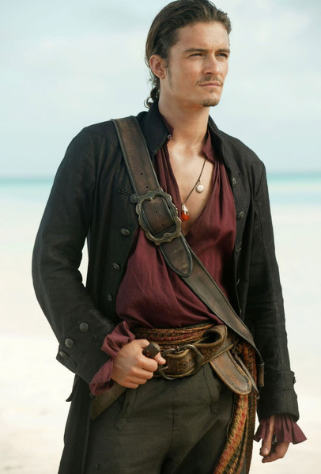

# Портрет

# История персонажа

Пират Хьюберт Борода. У него большая и густая борода. Он был сыном мореходца, но на их корабыль совершили налет пиратов. Всех убили, но его оставили служить пиратам как уборщицей. Много лет он плавал с пиратами. Как-то раз он проявил себя в бою с ебаными рыбаками убив троих и его признали как пирата. Вскоре за его заслуги он стал капитаном корабля. На одном из малых островов пираты встретили колдуна который за золото заколдовал Хьюберту его пиратскию саблю. После этого он решил вернутся на родной остров, но корабыль разбился и почти вся команда умерла, а те кто не умер убежали. Прокленая трюмных крыс Джек пошел собирать деньги на новый корабыль и команду.

## Черты
  Бдительность (+2 к проверкам внимания)
  
  Командный голос+ (+2 к проверкам характера)

  Привлекательность (+2 к харизме)

## Изъяны
  В розыске

  Упрямство (Этот упрямец всегда всё делает по‑своему и никогда не признаёт, что был не прав. Даже когда ясно, что персонаж совершает ошибку, он всё равно пытается доказать свою правоту полуправдой и заумными объяснениями.)

  Жадность (Ваш персонаж скуп и охоч до сокровищ. Если изъян мелкий, он каждый раз яростно спорит о том, какая часть добычи причитается ему. Если изъян крупный, персонаж будет биться до последнего, если ему показалось, что его несправедливо обделили, и он может даже убить за свою «честную долю».)

## Параметры
Характеристики и навыки (5 очков на характеристики и 17 на навыки):
- ЛОВКОСТЬ = 
  - Взлом = 
  - Вождение = 
  - Пилотирование = 
  - Верховая езда = 
  - Драка = 
  - Маскировка = 
  - Метание = 
  - Стрельба = 
- СМЕКАЛКА = 
  - Азартные игры = 
  - Внимание = 
  - Выживание = 
  - Провокация = 
  - Уличное чутье = 
  - Знание (Лечение) = 
  - Знание (Языки) = 
  - Знание (Инженер) = 
  - Знание (Кузнец) = 
  - Знание (Бронник) = 
  - Знание (Алхимия) = 
  - Знание (Магия) = 
- ХАРАКТЕР = 
  - Запугивание = 
  - Убеждение =  +3
  - Сверхестественный навык (Вера) = 
- СИЛА = 
  - Лазание = 
- ВЫНОСЛИВОСТЬ = 

Производные параметры:
- Шаг = *6*
- Бег = *6+d6*
- Защита = *5*
- Харизма = *0*
- Стойкость = *5*
- Максимум енергии = *12*

Состояние:
- Шок = *Нет*
- Ранение = *3*
- При смерти = *Нет* 
- Усталость = *1* 
- Базовые потребности = *Не реализованы*
  - Голод = *Голоден*
  - Жажда = *Есть*
  - Сон = *Спал* 
  - Погодные условия = *Не экстремальные*
- Острая инфекция = *Не заражен*
- Слабое отравление = *Не отравлен*

## Спасательные фишки
3 фишки

## Инвентарь
Волшебная сабля: урон (сила + d6). Защита +2. Слотов для рун 1. Магический эффект: если рядом водоем или дождь - может один раз за бой ударить по всем противникам водой, урон равен d6. Отнимает 1 энергии у персонажей с мистически даром, 3 энергии у обычных (как Хью).

Мушкет: урон (2d8) есть 14 пуль и порох к ним. Стрельба +1. Бронебойность 1.

Игральные карты (+1 к удаче если играют ими)

Пиратская шляпа. Пиратская одежда. Чучело попугая "Хьюберт мл.".

700 золотых, Магическое ожерелье с большим камнем бриллиантом

Арбалет: урон (2d6 + 2). Стрельба +1. Бронебойность 2.
1 арбалетный болт

## Опыт

30/50 (1 уровень)